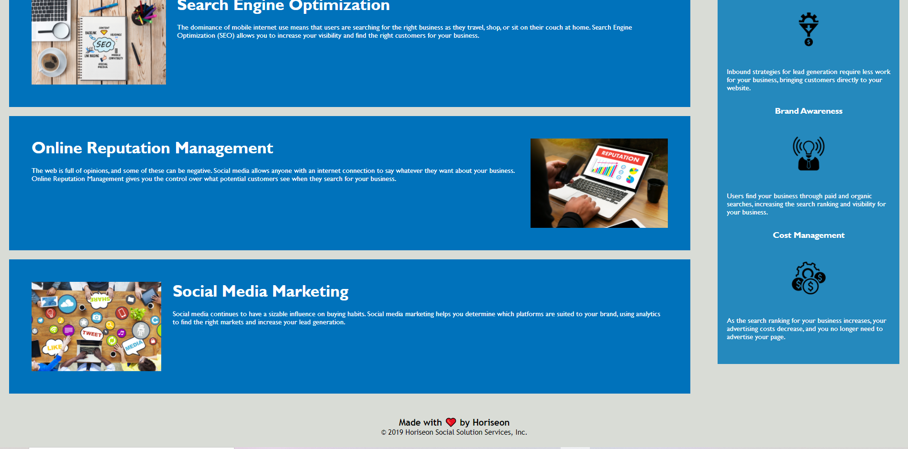

#  Code Refactor : HORISEON
## Expalniaton 
```
-The webpage meets accessibility standards by changing the background color in .benefits selector .
-Semantic HTML elements <header>,<nav>,<section>,<main>,<article> and <footer>.
-Structuer of the HTML elements <html>,<head>,<body> is found.
-Logical structuer independent of stylying and positioning in css.
-alt attributes accessilble .
-Heading attributes are viewd <h1,h2,h3> and they fall in sequential order.
-Title element is viewd <title>.
-Title is concise and describtive.
```
# sceenshots




# website links
[link](https://shaimajobran.github.io/code-refactor/)


